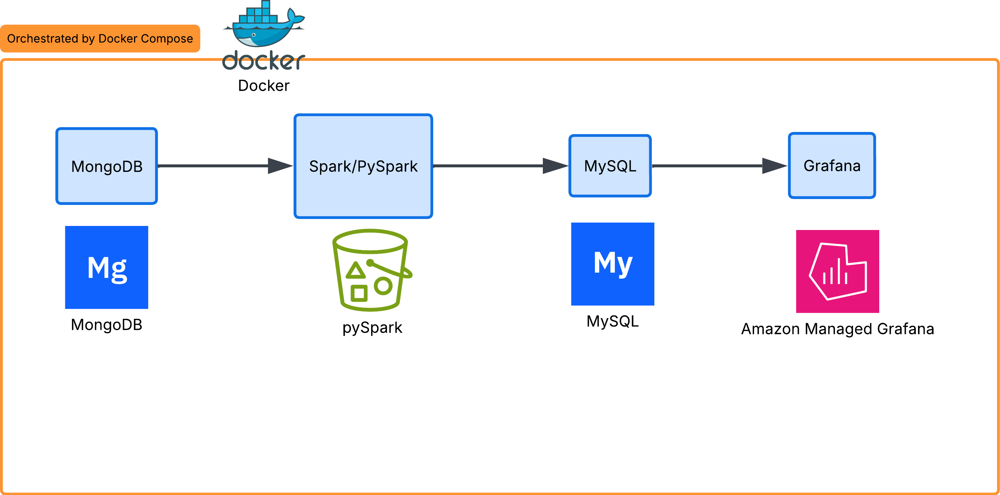

# Near Real-time Recruitment Data Pipeline



> Near-realtime pipeline xử lý dữ liệu tuyển dụng

## 📋 Giới thiệu
Hệ thống pipeline xử lý dữ liệu **Near Real-time** cho nền tảng tuyển dụng. Thu thập sự kiện tracking từ Data Lake, thực hiện aggregation và load vào Data Warehouse để phân tích và trực quan hóa.

---

##  Kiến trúc Pipeline
Recruitment Events
↓
[MongoDB] Data Lake
↓
[PySpark] ETL Processing
↓
[MySQL] Data Warehouse
↓
[Grafana] Visualization
text---

## 🛠 Công nghệ sử dụng

| Layer              | Công nghệ                    | Phiên bản   |
|--------------------|------------------------------|-------------|
| Data Lake          | MongoDB                      | 7.0         |
| ETL Engine         | PySpark (Local Mode)         | 3.5.4       |
| Data Warehouse     | MySQL                        | 8.0         |
| Visualization      | Grafana                      | Latest      |
| Container          | Docker Compose               | -           |
| Scheduling         | Linux Cron                   | -           |

---

##  Cấu trúc dự án
```bash
recruitment-pipeline/
├── docker-compose.yml
├── scripts/
│   ├── etl.py              # ETL Pipeline chính
│   ├── fake_data.py        # Tạo dữ liệu giả (Near Realtime)
│   └── run_etl.sh          # Script chạy ETL
├── logs/
│   ├── etl.log
│   └── fake_data.log
└── README.md
text---
```

##  Hướng dẫn chạy

### 1. Khởi động các service

```bash
docker compose up -d
```
### 2. Chạy Fake Data Generator (tạo dữ liệu mới mỗi 60 giây)
```
Bashdocker exec spark bash -c "
cd /opt/spark/scripts && 
nohup python3 fake_data.py > /var/log/fake_data.log 2>&1 &
"
```
### 3. Chạy ETL thủ công
```
docker exec spark bash -c "
cd /opt/spark && 
export JAVA_HOME=/opt/java/openjdk && 
python3 scripts/etl.py
```
### 4. Thiết lập Cron Job (chạy tự động mỗi 4 phút)
```
chmod +x scripts/run_etl.sh
crontab -r 2>/dev/null
(crontab -l 2>/dev/null; echo "*/4 * * * * /home/ubuntu/recruitment-pipeline/scripts/run_etl.sh") | crontab -
```
### 5. Grafana Dashboard
```
URL: http://<EC2_PUBLIC_IP>:3000
Tài khoản: admin / admin
Data Source: MySQL
Host: mysql:3306
Database: warehouse
User: root
Password: example
```
## Tính năng Near Real-time
```
Fake Data Generator tạo dữ liệu mới mỗi 60 giây
ETL Pipeline chạy tự động mỗi 4 phút
Dữ liệu được cập nhật liên tục vào MySQL và Grafana
```
